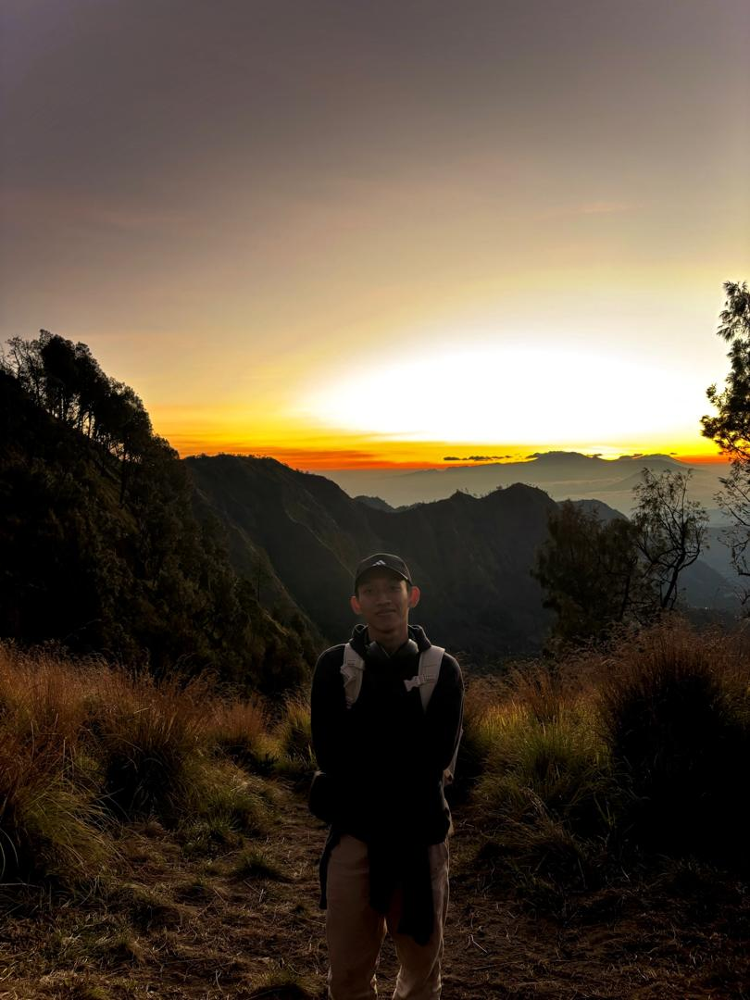

## M. Nurhakim says Hi!👋
# Third year student in Software Engineering, BCS at UM

My name is Muhammad Nurhakim, but you can just call me Hakim.

* Fun (but not so fun) fact: I love cats but somehow am a bit allergic to them.
* I am into photography
* You can reach me at [mnurhakimothman@gmail.com](mnurhakimothman@gmail.com)
* I dunno what to write anymore at this point.

# Languages and Tools:

